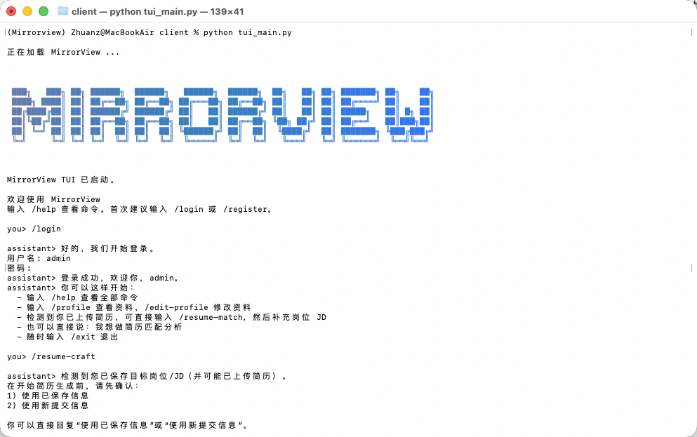
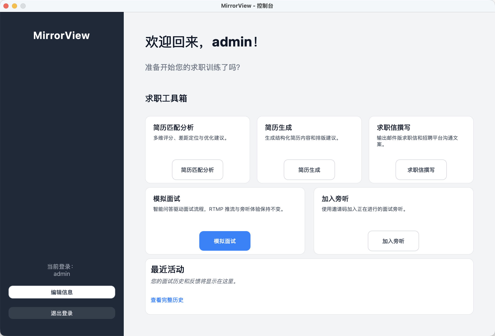
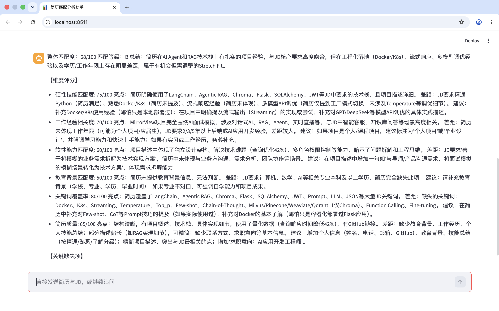
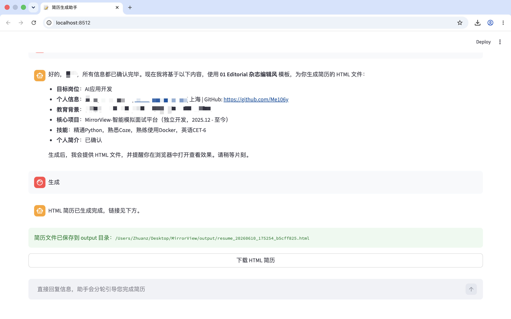

# MirrorView 🪞

<div align="center">

[](https://www.python.org/)
[](https://pypi.org/project/PyQt5/)
[](https://flask.palletsprojects.com/)
[](LICENSE)

**An AI-Powered Mock Interview Platform with Real-time Observation**

[English](README.md) | [中文](README_CN.md)

</div>

---

## 📖 Introduction

**MirrorView** is an intelligent mock interview application designed to help job seekers improve their interview skills through realistic simulations and AI-driven feedback. It combines a desktop client (PyQt5) with a robust backend server (Flask) to deliver a seamless experience.

Key features include **AI Interviewer** interactions, **Real-time Video Streaming**, and a unique **Observer Mode** that allows mentors or peers to watch live interviews and provide guidance.

## ✨ Key Features

### 🤖 AI Mock Interview
- **Personalized Questions**: Generates tailored interview questions based on your job intention and resume.
- **Voice Interaction**: Supports speech-to-text input (offline fallback available) for natural conversation.
- **Smart Feedback**: Provides comprehensive AI analysis, scoring, and improvement suggestions after each session.

### 👀 Observer Mode (Mirror View)
- **Live Streaming**: Broadcast your interview session via RTMP to allowed observers.
- **Real-time Transcript**: Observers see the synchronized chat history as the interview progresses.
- **Join via Code**: Simple invite code system for mentors to join sessions securely.

### 👤 User Profile
- **Resume Parsing**: Automatically extracts skills and project experience from uploaded resumes.
- **Job Intention Management**: Set and update your target role and experience level.
- **Interview History**: Review past performance, scores, and detailed feedback at any time.

## 🛠️ Technology Stack

- **Client**: Python, PyQt5, OpenCV, SpeechRecognition, PyAudio
- **Server**: Flask, SQLAlchemy, OpenAI/LangChain (for AI logic)
- **Streaming**: RTMP (Real-Time Messaging Protocol), FFmpeg
- **Database**: SQLite (default), extensible to PostgreSQL/MySQL

## 🚀 Getting Started

### Prerequisites
- Python 3.11
- FFmpeg (for video streaming)

### Installation

1. **Clone the repository**
   ```bash
   git clone https://github.com/yourusername/MirrorView.git
   cd MirrorView
   ```

2. **Install dependencies**
   ```bash
   pip install -r requirements.txt
   ```

3. **Create local config from example**
   ```bash
   cp server/config.json.example server/config.json
   ```
   Then edit `server/config.json` and set your `DEEPSEEK_API_KEY`.
   Environment variable `DEEPSEEK_API_KEY` still takes higher priority if both are set.

   On Windows (PowerShell):
   ```powershell
   Copy-Item server\config.json.example server\config.json
   ```

### Running the Application

1. **Start the Server**
   ```bash
   python server/app.py
   ```
   The server will start at `http://localhost:5001`.

2. **Start the Client**
   ```bash
   python client/main.py
   ```

3. **Start the TUI Client (Optional)**
   ```bash
   python client/tui_main.py
   ```
   The TUI startup will try to render the MirrorView logo via:
   `npx oh-my-logo "MirrorView" purple --filled --block-font block`

### One-Click Install (Prebuilt TUI App)

- macOS / Linux:
  ```bash
  curl -fsSL https://raw.githubusercontent.com/Zhuanz/MirrorView/main/install.sh | bash
  ```
- Windows:
  ```powershell
  powershell -ExecutionPolicy Bypass -File .\install.ps1
  ```

After install, set `DEEPSEEK_API_KEY` in `~/.mirrorview-tui/.env` (Windows: `%USERPROFILE%\.mirrorview-tui\.env`).

### CareerForge TUI Agent

- New chat endpoint: `POST /api/careerforge/agent/chat`
- Routing strategy: `/command` first, then keyword rules, then DeepSeek intent fallback
- Supported commands:
  - `/help`
  - `/login` `/register` `/logout`
  - `/profile` `/edit-profile`
  - `/resume-match` `/resume-craft` `/cover-letter` `/mock-interview` `/job-hunt`
  - `/skill <name>` `/cancel` `/exit`
- File artifacts (for example resume-match HTML report) are shown in TUI with clickable link + `[O]` one-key browser open.

## 📸 Screenshots











## 🤝 贡献指南

Welcome to submit Pull Requests or Issues to help improve this project!

## 📄 License

This project is licensed under the MIT License - see the [LICENSE](LICENSE) file for details.
