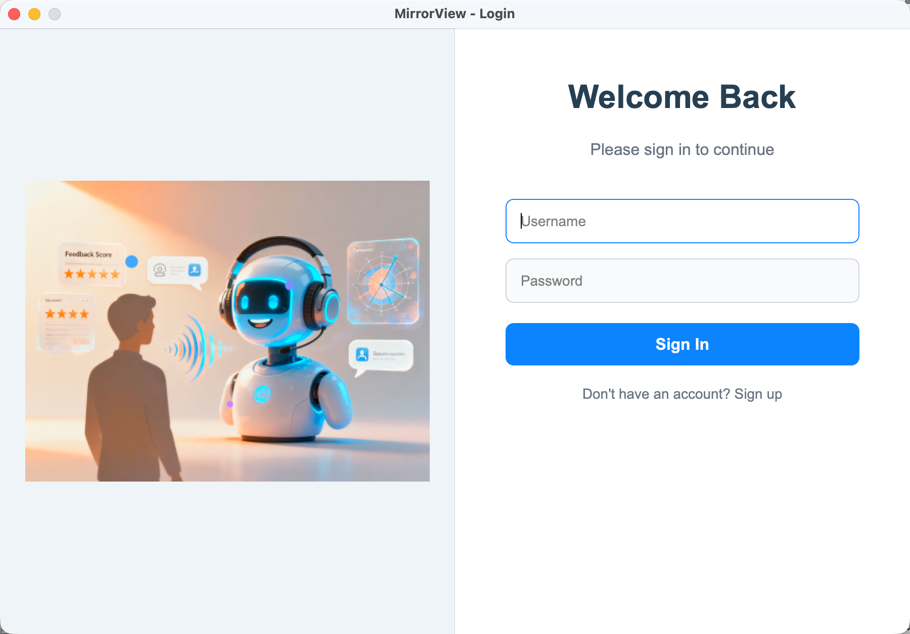
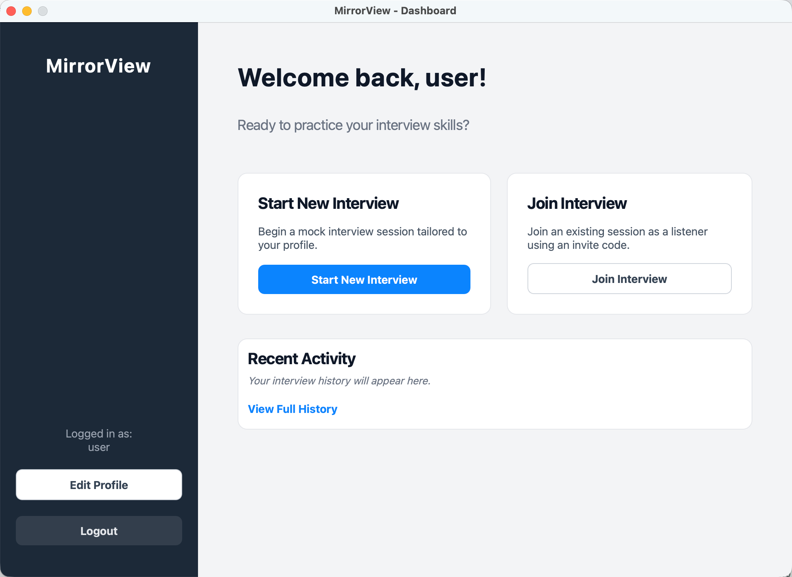
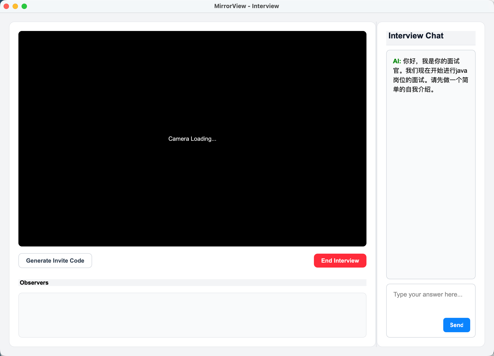

# MirrorView 🪞

<div align="center">

[](https://www.python.org/)
[](https://pypi.org/project/PyQt5/)
[](https://flask.palletsprojects.com/)
[](LICENSE)

**An AI-Powered Mock Interview Platform with Real-time Observation**

[English](README.md) | [中文](README_CN.md)

</div>

---

## 📖 Introduction

**MirrorView** is an intelligent mock interview application designed to help job seekers improve their interview skills through realistic simulations and AI-driven feedback. It combines a desktop client (PyQt5) with a robust backend server (Flask) to deliver a seamless experience.

Key features include **AI Interviewer** interactions, **Real-time Video Streaming**, and a unique **Observer Mode** that allows mentors or peers to watch live interviews and provide guidance.

## ✨ Key Features

### 🤖 AI Mock Interview
- **Personalized Questions**: Generates tailored interview questions based on your job intention and resume.
- **Voice Interaction**: Supports speech-to-text input (offline fallback available) for natural conversation.
- **Smart Feedback**: Provides comprehensive AI analysis, scoring, and improvement suggestions after each session.

### 👀 Observer Mode (Mirror View)
- **Live Streaming**: Broadcast your interview session via RTMP to allowed observers.
- **Real-time Transcript**: Observers see the synchronized chat history as the interview progresses.
- **Join via Code**: Simple invite code system for mentors to join sessions securely.

### 👤 User Profile
- **Resume Parsing**: Automatically extracts skills and project experience from uploaded resumes.
- **Job Intention Management**: Set and update your target role and experience level.
- **Interview History**: Review past performance, scores, and detailed feedback at any time.

## 🛠️ Technology Stack

- **Client**: Python, PyQt5, OpenCV, SpeechRecognition, PyAudio
- **Server**: Flask, SQLAlchemy, OpenAI/LangChain (for AI logic)
- **Streaming**: RTMP (Real-Time Messaging Protocol), FFmpeg
- **Database**: SQLite (default), extensible to PostgreSQL/MySQL

## 🚀 Getting Started

### Prerequisites
- Python 3.8+
- FFmpeg (for video streaming)

### Installation

1. **Clone the repository**
   ```bash
   git clone https://github.com/yourusername/MirrorView.git
   cd MirrorView
   ```

2. **Install dependencies**
   ```bash
   pip install -r requirements.txt
   ```

3. **Set environment variables (required)**
   ```bash
   export DEEPSEEK_API_KEY="your-deepseek-key"
   export BOSON_API_KEY="your-boson-key"
   ```
   Deployment note: in production (Docker/systemd/K8s/cloud), you must also set the same environment variables instead of hardcoding keys in source code.

### Running the Application

1. **Start the Server**
   ```bash
   python server/main.py
   ```
   The server will start at `http://localhost:5001`.

2. **Start the Client**
   ```bash
   python client/main.py
   ```

## 📸 Screenshots

*(Add screenshots of Main Window, Interview Interface, and Observer View here)*

## 🤝 Contributing







## 📄 License

This project is licensed under the MIT License - see the [LICENSE](LICENSE) file for details.
