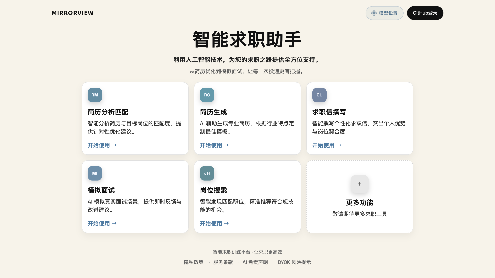
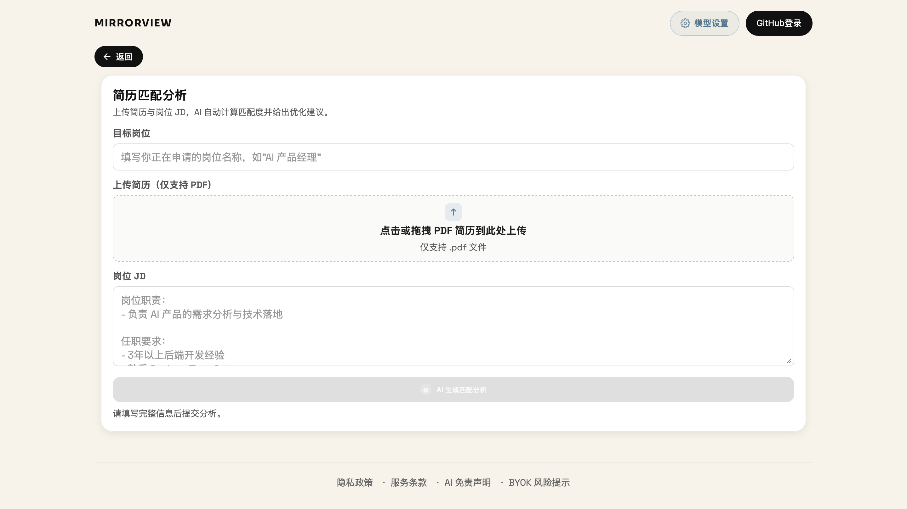
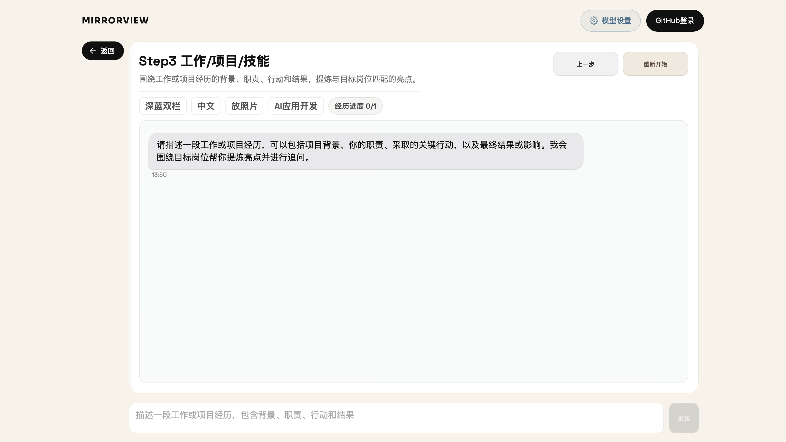

# MirrorView

MirrorView 是一个面向求职者的 AI 求职训练工作台，把岗位分析、简历准备、投递文案和面试练习放进同一条使用流程。

它不是用来生成泛泛的求职建议，而是帮助你从目标岗位和自己的真实经历出发，整理更清晰的证据，准备更有针对性的材料，并进行更有目的的面试练习。

[English](README.md) | 中文

## 我们希望实现什么

MirrorView 围绕一条实际的求职准备路径设计：

```text
理解岗位 -> 优化或生成简历 -> 撰写投递文案 -> 练习面试
```

每个工具都可以独立使用，也可以串联成完整的准备流程。长期目标是建立一个聚焦求职过程的工作台，让用户从一份岗位 JD 出发，逐步完成投递准备，而不必在每个工具中重复输入同样的信息。

## 如何使用

1. 打开 [MirrorView 网站](https://mirrorview.dpdns.org/)，进入右上角的“模型设置”。
2. 选择当前支持的模型服务，填写 API Key、Base URL 和模型名称，然后测试连接并保存。
3. 从首页选择需要的功能流程。
4. 按页面提示提供简历、岗位 JD 或个人经历信息。
5. 查看生成结果，根据需要修改输入；支持导出的简历或报告可以保存为 HTML 或 PDF。

模型 API Key 会保存在浏览器中，并用于发送你的模型请求。建议使用临时或额度受限的 Key，不再使用时及时吊销。不要把真实密钥放入截图、Issue 或共享文件中。

## 产品导览

首页是所有功能流程的入口：



### 简历匹配分析

上传 PDF 简历，填写目标岗位并粘贴岗位 JD。MirrorView 会结合岗位要求生成匹配度分析，指出你的优势和关键缺口，并给出可以直接执行的简历优化建议。



分析报告生成后，可以在网站中查看；支持的报告可以导出为 HTML 或 PDF。

### AI 简历生成

简历生成采用引导式流程：

- Step 1 设置目标岗位、JD 摘要、模板、语言和可选照片；
- Step 2 填写个人信息和教育背景；
- Step 3 通过对话整理工作经历、项目经历、技能和证书；
- 最后生成简历预览，并可继续修改和导出。

当前支持中文、英文和中英文双版输出，提供多种简历模板，支持可选个人照片、HTML 预览和 PDF 导出。



### 求职信撰写

输入公司名称、目标岗位 JD 和简历文本，再选择邮件或招聘平台聊天场景，即可生成针对具体岗位的投递文案，把你的经历与岗位要求联系起来。

### 文字模拟面试

输入目标岗位或第一条回答开始面试。AI 面试官会保留对话上下文并继续追问，适合练习：

- 自我介绍和岗位动机；
- 项目经历与行为面试问题；
- 技术、业务和场景题；
- 回答结构与面试表达。

### 岗位搜索

岗位搜索入口已经出现在产品导航中，但当前版本仍是占位页面。真实职位数据源、异步搜索和结果跟踪将在后续阶段接入。

## 当前功能状态

| 功能 | 当前状态 | 现在可以做什么                    |
|---|--|----------------------------|
| 简历匹配分析 | 可用 | 根据 PDF 简历、目标岗位和 JD 生成匹配分析。 |
| AI 简历生成 | 可用 | 引导创建简历，并支持 HTML/PDF 输出。    |
| 求职信撰写 | 规划中 | 生成邮件或招聘平台聊天场景的投递文案。        |
| 文字模拟面试 | 规划中 | 进行保留上下文的连续面试练习。            |
| 岗位搜索 | 规划中 | 搜索实时职位来源。                  |

## 使用须知

- AI 输出是求职准备草稿。正式使用前，请检查事实、日期、经历描述和排版。
- MirrorView 目前依赖用户配置的模型连接，服务可用性和费用取决于所选模型服务与 API Key。
- 简历或报告能否导出，取决于对应流程是否成功完成；导出内容仍需要由用户自行审核。

## License

本项目采用 MIT License，详见 [LICENSE](LICENSE)。
